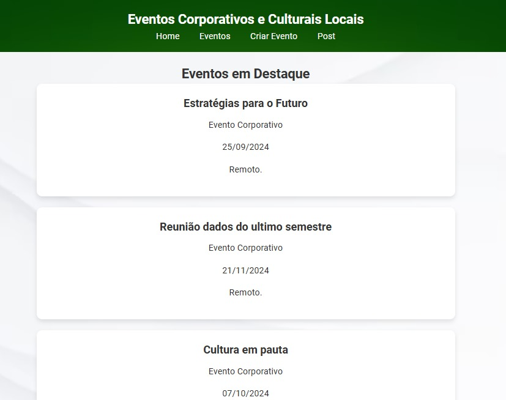
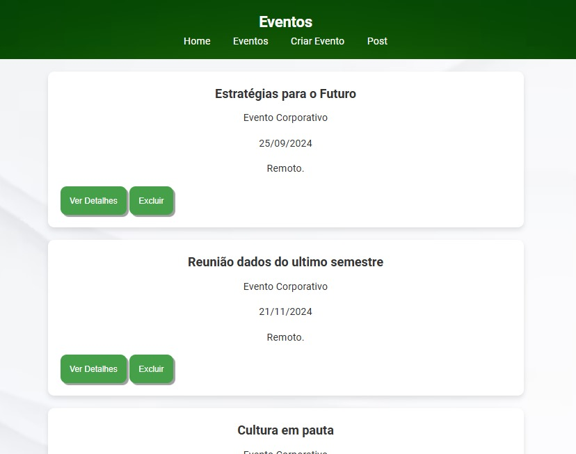
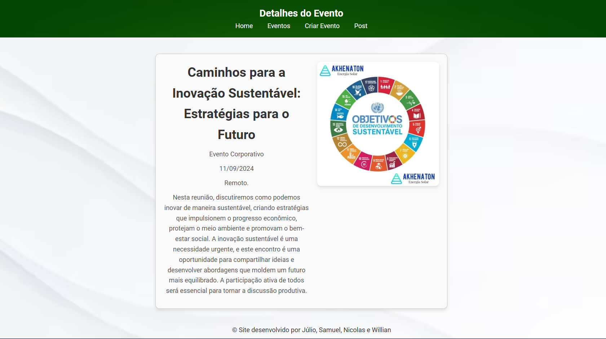
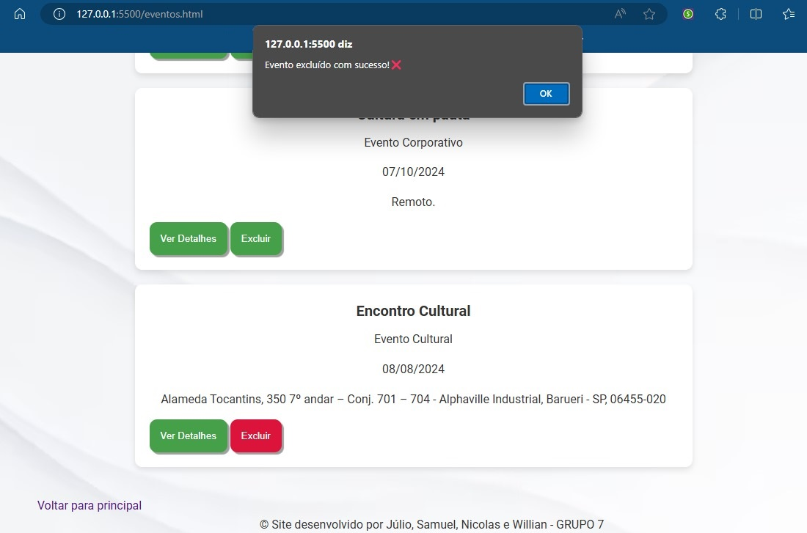
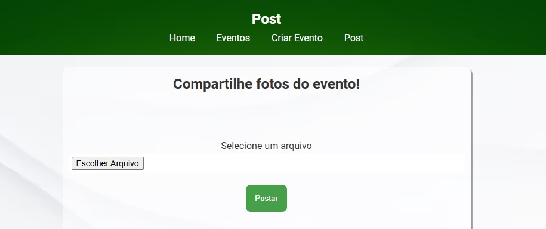
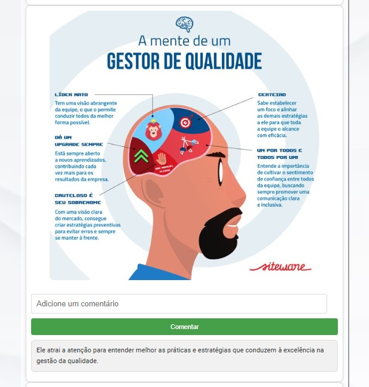

# Desafio Desenvolvimento Web

Desafio desenvolvido em grupo utilizando Html, Css e Java Script.
 
 
 

# Página inicial - Home

</img>
 
 
 

# Página Eventos

</img>
 
 
Funcionalidade do botão Ver detalhes
</img>
 
 
 
Funcionalidade do botão Excluir
</img>
 
 
 

# Página Criar Eventos

</img>
 
 
 

# Página Post

</img>
 
 

imagem postada e exemplo da funcionalidade comentar.
</img>
 
 
 

# Video Demonstração do Site

O video de demonstração se encotra na pasta assets/assets-videofuncionalidadeSite.
